# MMM-market    小型购物平台

## 开发工具

项目JDK：Oracle OpenJDK version 19.0.1

javafx:    gluon version 19-ea+7

JetBrain IntelliJ IDEA 2022.2.4

Gluon Scene Builder 19.0.0

MySQL 8.0

## 项目介绍

基于Java语言开发的小型超市购物系统，具有注册，登录，搜索，加入购物车，一键下单等功能；

## 页面展示

### 登录页面

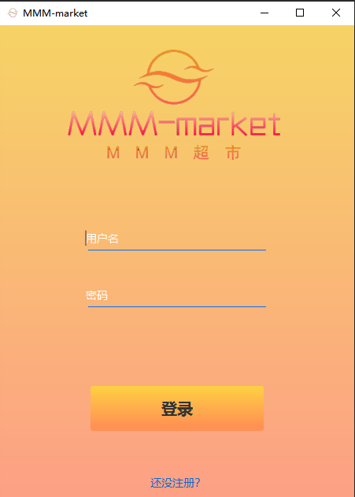

### 注册页面

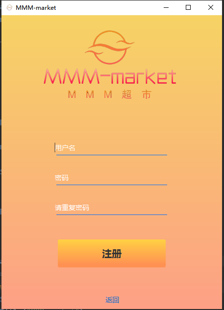

### 主页面

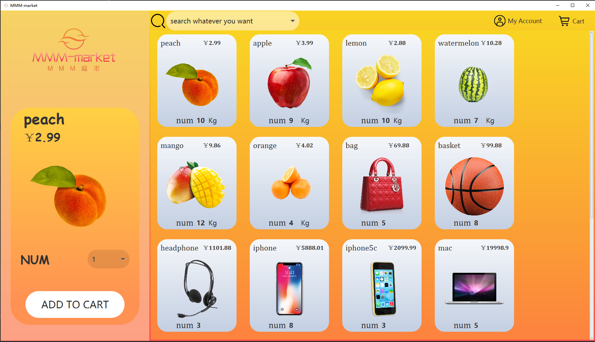

### 购物车页面

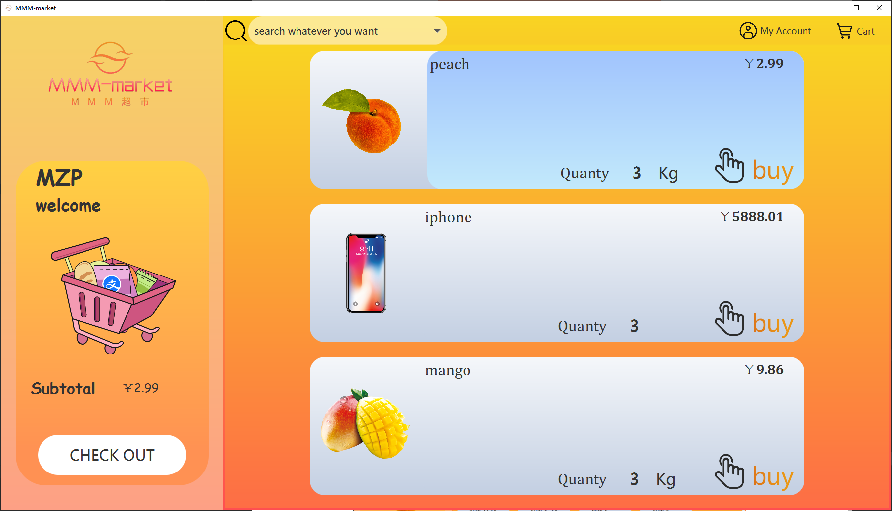

### 账户信息页面


## 功能介绍

### 校验用户信息

若用户名与答案不匹配，提示密码错误且无法登录；

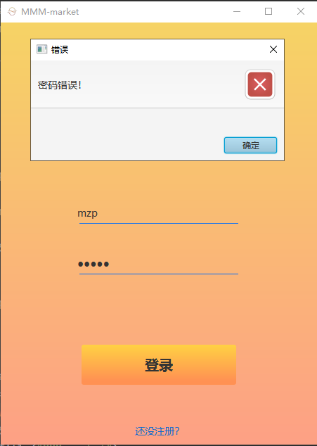

### 提供用户注册功能

若为新用户可注册并登录；

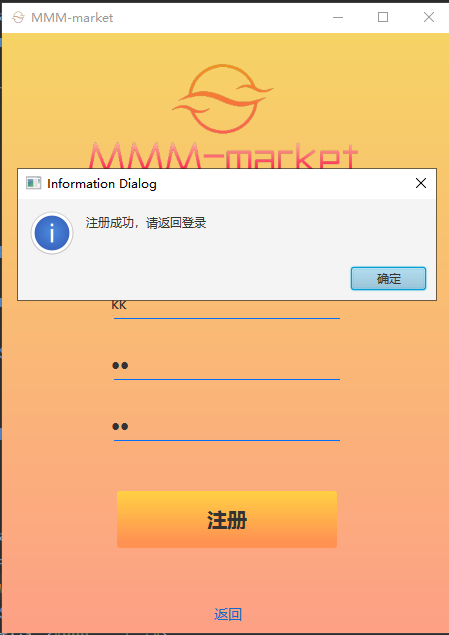

### 商品选中提醒

此时选中“iPhone”，左边展示框相应展出“iPhone”信息，且右侧小框变色，当鼠标略过商品时也会变色提醒，但截图无法展现这一特性；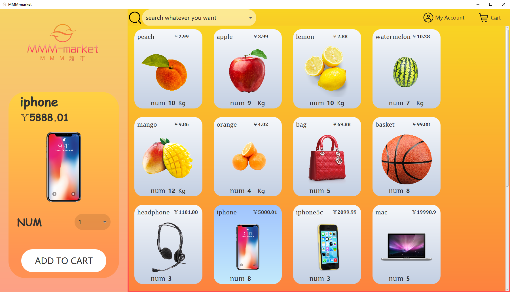

### 加入购物车

选中商品及欲购买数量时，点击“ADD TO CART”按钮，出现提示框提醒用户注意加购信息是否正确；

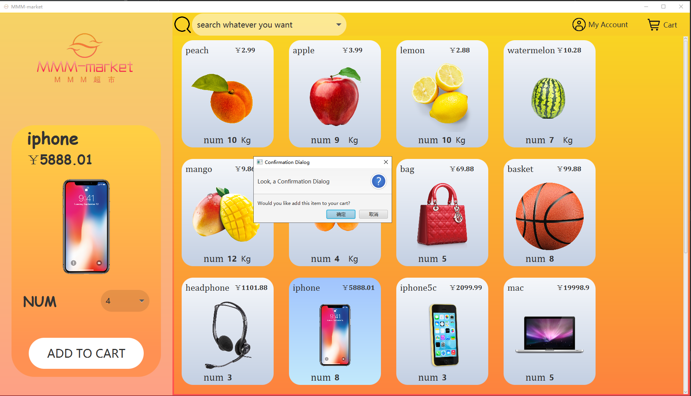

### 搜索功能

当在右半部分上侧的搜索框中输入想购买的物品信息时，检索全局物品，若具有符合物品，则选中该物品，并变色提醒用户（下图搜索框中的内容为“mac”）；

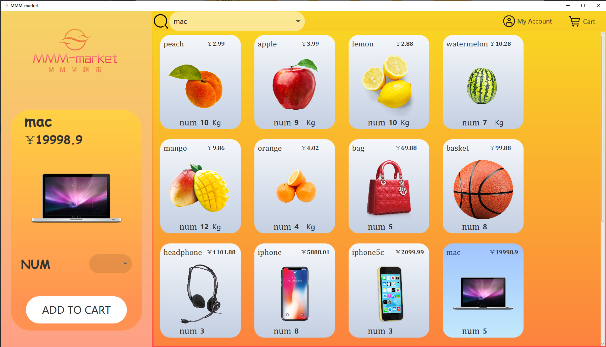

### 购物车结算

当点击右侧物品时，相应地进行变色提醒已被选中，并在左侧小框中计算对应金额，点击“CHECK OUT”按钮可进行结算，并根据结果判定是否下单成功。

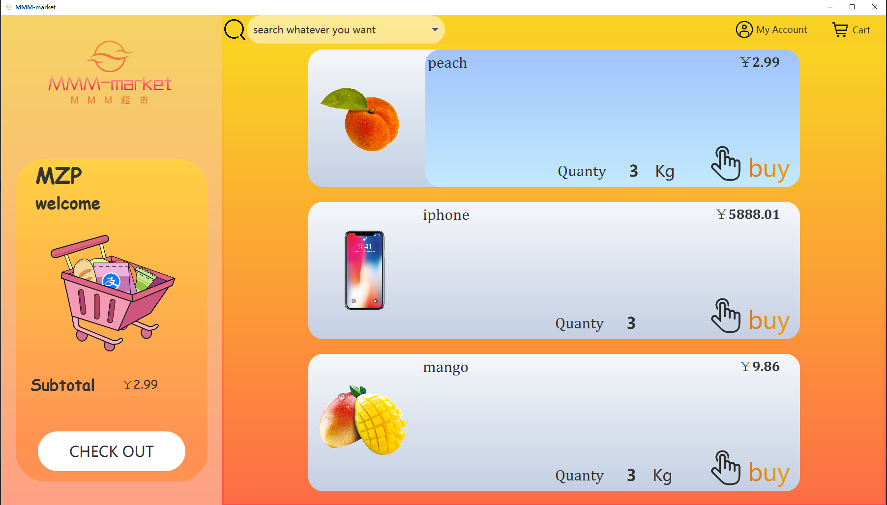

## 功能实现

### 数据库部分

创建属于该项目的数据库，其中包含"tb_admin","tb_cart","tb_items","tb_user"四张表，分别用来存储管理员，购物车，商品及用户信息；

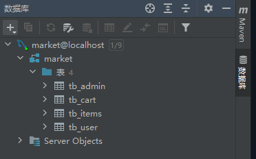

在代码中实现SQL类，利用JDBC连接数据库，针对不同的数据库操作，在SQL类中实现相对应的函数，例如`public boolean insertUserInfo(String name, String password)`
为将新用户注册信息插入数据库中，`public List<Item> itemsInitialize() throws SQLException`为加载主页面时读取商品库，并返回商品信息；

利用`setTable(String tablename)`函数指定要执行操作的表；

```
public void setTable(String tablename) {
    this.table = tablename;
}
```

### 代码部分

#### 项目结构

```
D:.
├─.idea
│  ├─dataSources
│  │  └─fa4ee825-338b-470a-b5ba-93619d94517d
│  │      └─storage_v2
│  │          └─_src_
│  │              └─schema
│  └─libraries
├─.mvn
│  └─wrapper
├─src
│  └─main
│      ├─java
│      │  ├─controller
│      │  ├─main
│      │  └─model
│      └─resources
│          ├─css
│          ├─image
│          └─main
└─target
    ├─classes
    │  ├─controller
    │  ├─css
    │  ├─image
    │  ├─main
    │  └─model
    └─generated-sources
        └─annotations
```

`/java/controller/`下主要包含FXML文件的controller文件；

`/java/main/`包含javafx应用程序启动函数；

`/java/model/`包含一些对象构造函数，如”item“类，”alertMessage“类等；

`/resource/main/`包含页面布局的FXML文件；

`/resource/css/`包含美化页面样式的css文件；

`/resource/image/`为本项目所用到的图片。

#### 函数实现

home界面需要根据数据库中所储存的商品信息加载相应的商品并展示，利用`Initializable`接口在`HomeController`中实现`initialize`
函数并在加载home界面时对其进行初始化；

同样的，在`CartController`中重写`initialize`函数对购物车页面进行加载；

对于商品展示，单独构建`item.fxml`文件设计布局，并利用`home.fxml`文件内放置的`tilePane`面板在执行`initialize`函数时进行规律布局放置：

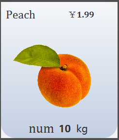

```
for (int i = 0; i < items.size(); i++) {
    FXMLLoader fxmlLoader = new FXMLLoader();
    fxmlLoader.setLocation(getClass().getResource("/main/item.fxml"));
    AnchorPane anchorPane = fxmlLoader.load();

    ItemController itemController = fxmlLoader.getController();
    itemController.setdata(items.get(i), myListener);
    itemControllerMap.put(items.get(i).getName(), itemController);
    tilePane.getChildren().add(anchorPane);
}
```

在home界面加购的物品放入`List<Item>`中，在点击Cart按钮后，将`List<Item>`中的信息写入数据库”tb_cart"
表中，并在写入后，重新读取"tb_cart"表对cart页面进行加载。

## 存在问题

### 页面切换卡顿

由于每次切换界面需要在`initialize`函数中读取数据库数据并加载，此项操作较为耗时，当点击按钮后需要延迟一会儿才能显示页面，对于用户体验来说较为差劲；

尝试解决该问题，所需用到多线程编程，延迟加载等技术，由于时间精力有限，暂未及时学习更新；

### 数据路径问题

项目新建时，在创建数据库时将图片路径存为了绝对路径，而非该项目目录结构下的相对路径，由此会导致该项目只能在本地环境正常运行，在其他运行环境下图片无法正常加载的情况。

## 结语

通过学习完成这项Java应用程序，不仅了解了如何绑定数据库，并学习使用MySQL语句进行查询，插入，删除等操作；

同时也明白了要想写出一项用户体验良好的程序，不仅要利用前端知识美化页面，同时也要设计出能够给用户基本良好观感的页面布局的道理；

要想写出一个更加合格的程序作品，还需要学习更多有关软件开发的知识，在不断学习中不断成长，共勉！


